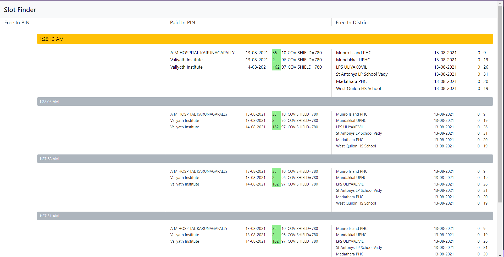
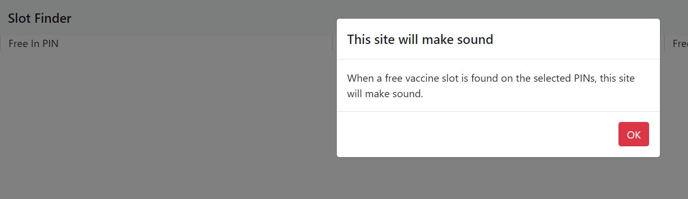

# 💉 Vaccine Slot Finder

Simple, minimal, yet another vaccine slot finder written in Node.js at late night 😴

 

## What

- Makes sounds when a free slot is detected on configured PIN(s).
- Monitors
  - free slots in configured PIN(s).
  - paid slots in configured PIN(s).
  - free slots in configured district.

> Not investing too much effort into project - you know the reason!

## Features

no fancy features - but reliable (for me).

- no DB
- plain js and fastify
- typescript
- automatic dom clean up
- history will be lost on page refresh (feature!)
- socket
- well defined data pipeline using Node.js streams
- Only 2 files
  - `server.ts`
  - `index.html` in plain js

## Installation / Usage

> Tested on Node.js 14 and Chrome 92 at 2am in half sleep 💤

- clone the repo
- `yarn install`
- `npm start`
- hit http://localhost:3000
- keep it open until you find your slot

## Configure PIN and District

go to `src/server.ts` and edit

```ts
const PINS = ["690518"];
const DISTRICT_ID = "298"; // Kollam
const DISTRICT_NAME = "Kollam";
const POLL_INTERVAL = 1000 * 7;
const MIN_AGE = 18;
```

To find district id, check with the https://dashboard.cowin.gov.in/

> Please don't make issues. PRs are welcome. Going to sleep 🛌

## Licence

MIT &copy; Vajahath
